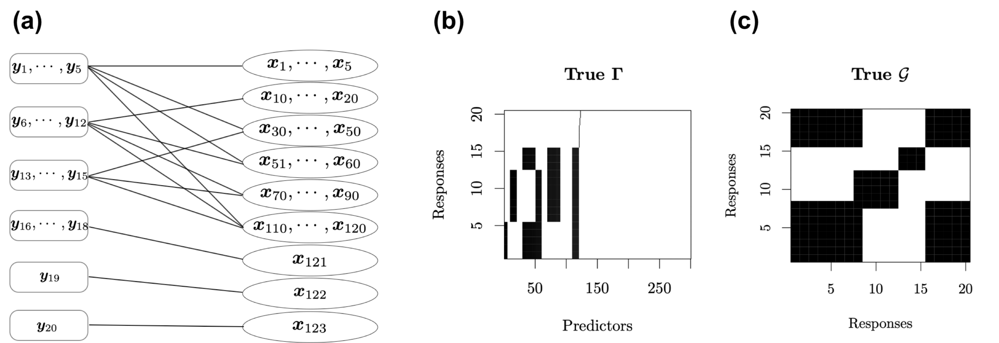

# BayesSUR

<!-- badges: start -->

[](https://cran.r-project.org/package=BayesSUR)
[](https://mbant.r-universe.dev/BayesSUR)
[](https://github.com/zhizuio/BayesSUR/actions)
[](https://opensource.org/licenses/MIT)

<!-- badges: end -->


This R package is for high-dimensional multivariate Bayesian variable and covariance selection in linear regression, including methods in [Bottolo et al. (2021)](https://doi.org/10.1111/rssc.12490), [Zhao et al. (2021)](https://doi.org/10.18637/jss.v100.i11) and [Zhao et al. (2024)](https://doi.org/10.1093/jrsssc/qlad102). 
See the package vignettes [`BayesSUR.pdf`](inst/doc/BayesSUR.pdf) for more information and an additional example below for the BayesSUR model with random effects.

## Installation

Install the latest released version from [CRAN](https://CRAN.R-project.org/package=BayesSUR)

```r
install.packages("BayesSUR")
```

Install the latest development version from GitHub

```r
#install.packages("remotes")
remotes::install_github("mbant/BayesSUR/BayesSUR")
```

## Additional example

The BayesSUR model has been extended to include mandatory variables by assigning Gaussian priors as random effects rather than spike-and-slab priors, named as **SSUR-MRF with random effects** in [Zhao et al. 2023](https://doi.org/10.1093/jrsssc/qlad102).
The R code for the simulated data and real data analyses in [Zhao et al. 2023](https://doi.org/10.1093/jrsssc/qlad102) can be found at the GitHub repository [BayesSUR-RE](https://github.com/zhizuio/BayesSUR-RE).

Here, we show a simulation example to run the BayesSUR mdoel with random effects.

### Simulate data

We design a network as the following figure (a) to construct a complex structure between $20$ response variables and $300$ predictors.
It assumes that the responses are divided into six groups, and the first $120$ predictors are divided into nine groups.



_**Figure**: True relationships between response variables and predictors.
(a) Network structure between $\mathbf Y$ and $\mathbf X$.
(b) Spare latent indicator variable $\Gamma$ for the associations between $\mathbf Y$ and $\mathbf X$ in the SUR model.
Black blocks indicate nonzero coefficients and white blocks indicate zero coefficients.
(c) Additional structure in the residual covariance matrix between response variables not explained by $\mathbf X\mathbf B$.
Black blocks indicate correlated residuals of the corresponding response variables and white blocks indicate uncorrelated residuals of the corresponding response variables._

<br>

Load the simulation function `sim.ssur()` as follows.

```{r}
sim.ssur <- function(n, s, p, t0 = 0, seed = 123, mv = TRUE,
                     t.df = Inf, random.intercept = 0, intercept = TRUE) {
  # set seed to fix coefficients
  set.seed(7193)
  sd_b <- 1
  mu_b <- 1
  b <- matrix(rnorm((p + ifelse(t0 == 0, 1, 0)) * s, mu_b, sd_b), p + ifelse(t0 == 0, 1, 0), s)

  # design groups and pathways of Gamma matrix
  gamma <- matrix(FALSE, p + ifelse(t0 == 0, 1, 0), s)
  if (t0 == 0) gamma[1, ] <- TRUE
  gamma[2:6 - ifelse(t0 == 0, 0, 1), 1:5] <- TRUE
  gamma[11:21 - ifelse(t0 == 0, 0, 1), 6:12] <- TRUE
  gamma[31:51 - ifelse(t0 == 0, 0, 1), 1:5] <- TRUE
  gamma[31:51 - ifelse(t0 == 0, 0, 1), 13:15] <- TRUE
  gamma[52:61 - ifelse(t0 == 0, 0, 1), 1:12] <- TRUE
  gamma[71:91 - ifelse(t0 == 0, 0, 1), 6:15] <- TRUE
  gamma[111:121 - ifelse(t0 == 0, 0, 1), 1:15] <- TRUE
  gamma[122 - ifelse(t0 == 0, 0, 1), 16:18] <- TRUE
  gamma[123 - ifelse(t0 == 0, 0, 1), 19] <- TRUE
  gamma[124 - ifelse(t0 == 0, 0, 1), 20] <- TRUE

  G_kron <- matrix(0, s * p, s * p)
  G_m <- bdiag(matrix(1, ncol = 5, nrow = 5),
               matrix(1, ncol = 7, nrow = 7),
               matrix(1, ncol = 8, nrow = 8))
  G_p <- bdiag(matrix(1, ncol = 5, nrow = 5), diag(3),
               matrix(1, ncol = 11, nrow = 11), diag(9),
               matrix(1, ncol = 21, nrow = 21),
               matrix(1, ncol = 10, nrow = 10), diag(9),
               matrix(1, ncol = 21, nrow = 21), diag(19),
               matrix(1, ncol = 11, nrow = 11), diag(181))
  G_kron <- kronecker(G_m, G_p)

  combn11 <- combn(rep((1:5 - 1) * p, each = length(1:5)) +
                     rep(1:5, times = length(1:5)), 2)
  combn12 <- combn(rep((1:5 - 1) * p, each = length(30:60)) +
                     rep(30:60, times = length(1:5)), 2)
  combn13 <- combn(rep((1:5 - 1) * p, each = length(110:120)) +
                     rep(110:120, times = length(1:5)), 2)
  combn21 <- combn(rep((6:12 - 1) * p, each = length(10:20)) +
                     rep(10:20, times = length(6:12)), 2)
  combn22 <- combn(rep((6:12 - 1) * p, each = length(51:60)) +
                     rep(51:60, times = length(6:12)), 2)
  combn23 <- combn(rep((6:12 - 1) * p, each = length(70:90)) +
                     rep(70:90, times = length(6:12)), 2)
  combn24 <- combn(rep((6:12 - 1) * p, each = length(110:120)) +
                     rep(110:120, times = length(6:12)), 2)
  combn31 <- combn(rep((13:15 - 1) * p, each = length(30:50)) +
                     rep(30:50, times = length(13:15)), 2)
  combn32 <- combn(rep((13:15 - 1) * p, each = length(70:90)) +
                     rep(70:90, times = length(13:15)), 2)
  combn33 <- combn(rep((13:15 - 1) * p, each = length(110:120)) +
                     rep(110:120, times = length(13:15)), 2)
  combn4 <- combn(rep((16:18 - 1) * p, each = length(121)) +
                    rep(121, times = length(16:18)), 2)
  combn5 <- matrix(rep((19 - 1) * p, each = length(122)) +
                     rep(122, times = length(19)), nrow = 1, ncol = 2)
  combn6 <- matrix(rep((20 - 1) * p, each = length(123)) +
                     rep(123, times = length(20)), nrow = 1, ncol = 2)

  combnAll <- rbind(t(combn11), t(combn12), t(combn13),
                    t(combn21), t(combn22), t(combn23), t(combn24),
                    t(combn31), t(combn32), t(combn33),
                    t(combn4), combn5, combn6)

  set.seed(seed + 7284)
  sd_x <- 1
  x <- matrix(rnorm(n * p, 0, sd_x), n, p)

  if (t0 == 0 & intercept) x <- cbind(rep(1, n), x)
  if (!intercept) {
    gamma <- gamma[-1, ]
    b <- b[-1, ]
  }
  xb <- matrix(NA, n, s)
  if (mv) {
    for (i in 1:s) {
      if (sum(gamma[, i]) >= 1) {
        if (sum(gamma[, i]) == 1) {
          xb[, i] <- x[, gamma[, i]] * b[gamma[, i], i]
        } else {
          xb[, i] <- x[, gamma[, i]] %*% b[gamma[, i], i]
        }
      } else {
        xb[, i] <- sapply(1:s, function(i) rep(1, n) * b[1, i])
      }
    }
  } else {
    if (sum(gamma) >= 1) {
      xb <- x[, gamma] %*% b[gamma, ]
    } else {
      xb <- sapply(1:s, function(i) rep(1, n) * b[1, i])
    }
  }

  corr_param <- 0.9
  M <- matrix(corr_param, s, s)
  diag(M) <- rep(1, s)

  ## wanna make it decomposable
  Prime <- list(c(1:(s * .4), (s * .8):s),
                c((s * .4):(s * .6)),
                c((s * .65):(s * .75)),
                c((s * .8):s))
  G <- matrix(0, s, s)
  for (i in 1:length(Prime)) {
    G[Prime[[i]], Prime[[i]]] <- 1
  }

  # check
  dimnames(G) <- list(1:s, 1:s)
  length(gRbase::mcsMAT(G - diag(s))) > 0

  var <- solve(BDgraph::rgwish(n = 1, adj = G, b = 3, D = M))

  # change seeds to add randomness on error
  set.seed(seed + 8493)
  sd_err <- 0.5
  if (is.infinite(t.df)) {
    err <- matrix(rnorm(n * s, 0, sd_err), n, s) %*% chol(as.matrix(var))
  } else {
    err <- matrix(rt(n * s, t.df), n, s) %*% chol(as.matrix(var))
  }

  if (t0 == 0) {
    b.re <- NA
    z <- NA
    y <- xb + err
    if (random.intercept != 0) {
      y <- y + matrix(rnorm(n * s, 0, sqrt(random.intercept)), n, s)
    }

    z <- sample(1:4, n, replace = T, prob = rep(1 / 4, 4))

    return(list(y = y, x = x, b = b, gamma = gamma, z = model.matrix(~ factor(z) + 0)[, ],
                b.re = b.re, Gy = G, mrfG = combnAll))
  } else {
    # add random effects
    z <- t(rmultinom(n, size = 1, prob = c(.1, .2, .3, .4)))
    z <- sample(1:t0, n, replace = T, prob = rep(1 / t0, t0))
    set.seed(1683)
    b.re <- rnorm(t0, 0, 2)
    y <- matrix(b.re[z], nrow = n, ncol = s) + xb + err

    return(list(
      y = y, x = x, b = b, gamma = gamma, z = model.matrix(~ factor(z) + 0)[, ],
      b.re = b.re, Gy = G, mrfG = combnAll
    ))
  }
}
```

To simulate data with sample size $n=250$, responsible variables $s=20$ and covariates $p=300$, we can specify the corresponding parameters in the function `sim.ssur()` as follows.

```{r}
library("BayesSUR")
library("Matrix")
n <- 250
s <- 20
p <- 300
sim1 <- sim.ssur(n, s, p, seed = 1)
```

To simulate data from $4$ individual groups with group indicator variables following the defaul multinomial distribution $multinomial(0.1,0.2,0.3,0.4)$, we can simply add the argument `t0 = 4` in the function `sim.ssur()` as follows.

```{r}
t0 <- 4
sim2 <- sim.ssur(n, s, p, t0, seed = 1) # learning data
sim2.val <- sim.ssur(n, s, p, t0, seed=101) # validation data
```

### Run BayesSUR model with random effects

According to the guideline of prior specification in [Zhao et al. 2023](https://doi.org/10.1093/jrsssc/qlad102), we first set the following parameters `hyperpar` and then running the BayesSUR model with random effects via `betaPrior = "reGroup"` (default `betaPrior = "independent"` with spike-and-slab priors for all coefficients). 
**For illustration, we run a short MCMC** with `nIter = 300` and `burnin = 100`. 
Note that here the graph used for the Markov random field prior is the true graph from the returned object of the simulation `sim2$mrfG`.

```{r}
hyperpar <- list(mrf_d = -2, mrf_e = 1.6, a_w0 = 100, b_w0 = 500, a_w = 15, b_w = 60)
set.seed(1038)
fit2 <- BayesSUR(
  data = cbind(sim2$y, sim2$z, sim2$x),
  Y = 1:s,
  X_0 = s + 1:t0,
  X = s + t0 + 1:p,
  outFilePath = "sim2_mrf_re",
  hyperpar = hyperpar,
  gammaInit = "0",
  betaPrior = "reGroup",
  nIter = 300, burnin = 100,
  covariancePrior = "HIW",
  standardize = F,
  standardize.response = F,
  gammaPrior = "MRF",
  mrfG = sim2$mrfG,
  output_CPO = T
)
```

```
## BayesSUR -- Bayesian Seemingly Unrelated Regression Modelling
## Reading input files ... ... successfull!
## Clearing and initialising output files
## Initialising the (SUR) MCMC Chain ...  ...  DONE!
## Drafting the output files with the start of the chain ... DONE!
##
## Starting 2 (parallel) chain(s) for 300 iterations:
## Temperature ladder updated, new temperature ratio : 1.1
##  MCMC ends.   --- Saving results and exiting
## Saved to :   sim2_mrf_re1/data_SSUR_****_out.txt
## Final w0  : 5.43872
## Final w   : 0.151529
## Final tau : 5.03502    w/ proposal variance: 1.25175
## Final eta : 0.0404965
##   -- Average Omega : 0
## Final temperature ratio : 1.1
##
## DONE, exiting!
```

Check some summarized information of the results:

```{r}
summary(fit2)
```

```
## Call:
##   BayesSUR(data = cbind(sim2$y, sim2$z, sim2$x), ...)
##
## CPOs:
##         Min.      1st Qu.       Median      3rd Qu.         Max.
## 0.0001880944 0.0242389626 0.0347986252 0.0465162558 0.1307315429 
## 
## Number of selected predictors (mPIP > 0.5): 2823 of 20x300
## 
## Top 10 predictors on average mPIP across all responses:
##    X.251     X.27    X.296    X.196    X.285    X.130     X.32    X.104     X.58     X.10 
## 0.729580 0.702225 0.695755 0.672865 0.656705 0.653220 0.651730 0.643770 0.638795 0.635315 
## 
## Top 10 responses on average mPIP across all predictors:
##       X.5       X.8      X.19      X.12       X.4      X.11      X.10      X.14      X.16       X.9 
## 0.5099717 0.4958283 0.4896067 0.4811993 0.4784647 0.4766230 0.4744843 0.4743030 0.4742693 0.4740880 
## 
## Expected log pointwise predictive density (elpd) estimates:
##   elpd.LOO = -16836.31,  elpd.WAIC = -16834.33
## 
## MCMC specification:
##   iterations = 300,  burn-in = 100,  chains = 2
##   gamma local move sampler: bandit
##   gamma initialisation: 0
## 
## Model specification:
##   covariance prior: HIW
##   gamma prior: MRF
## 
## Hyper-parameters:
##   a_w   b_w    nu a_tau b_tau a_eta b_eta mrf_d mrf_e  a_w0  b_w0 
##  15.0  60.0  22.0   0.1  10.0   0.1   1.0  -2.0   1.6 100.0 500.0 
```

Compute the model performace with respect to **variable selection**

```{r}
# compute accuracy, sensitivity, specificity of variable selection
gamma <- getEstimator(fit2)
(accuracy <- sum(data.matrix(gamma > 0.5) == sim2$gamma) / prod(dim(gamma)))
```

```
## [1] 0.5371667
```

```{r}
(sensitivity <- sum((data.matrix(gamma > 0.5) == 1) & (sim2$gamma == 1)) / sum(sim2$gamma == 1))
```

```
## [1] 0.5298701
```

```{r}
(specificity <- sum((data.matrix(gamma > 0.5) == 0) & (sim2$gamma == 0)) / sum(sim2$gamma == 0))
```

```
## [1] 0.5382409
```

Compute the model performance with respect to **response prediction**

```{r}
# compute RMSE and RMSPE for prediction performance
beta <- getEstimator(fit2, estimator = "beta", Pmax = .5, beta.type = "conditional")
(RMSE <- sqrt(sum((sim2$y - cbind(sim2$z, sim2$x) %*% beta)^2) / prod(dim(sim2$y))))
```

```
## [1] 7.134064
```

```{r}
(RMSPE <- sqrt(sum((sim2.val$y - cbind(sim2.val$z, sim2.val$x) %*% beta)^2) / prod(dim(sim2.val$y))))
```

```
## [1] 8.269975
```

Compute the model performance with respect to **coefficient bias**

```{r}
# compute bias of beta estimates
b <- sim2$b
b[sim2$gamma == 0] <- 0
(beta.l2 <- sqrt(sum((beta[-c(1:4), ] - b)^2) / prod(dim(b))))
```

```
## [1] 0.4617231
```

Compute the model performance with respect to **covariance selection**

```{r}
g.re <- getEstimator(fit2, estimator = "Gy")
(g.accuracy <- sum((g.re > 0.5) == sim2$Gy) / prod(dim(g.re)))
```

```
## [1] 0.51
```

```{r}
(g.sensitivity <- sum(((g.re > 0.5) == sim2$Gy)[sim2$Gy == 1]) / sum(sim2$Gy == 1))
```

```
## [1] 0.1089109
```

```{r}
(g.specificity <- sum(((g.re > 0.5) == sim2$Gy)[sim2$Gy == 0]) / sum(sim2$Gy == 0))
```

```
## [1] 0.9191919
```

## References

> Leonardo Bottolo, Marco Banterle, Sylvia Richardson, Mika Ala-Korpela, Marjo-Riitta Järvelin, Alex Lewin (2021).
> A computationally efficient Bayesian seemingly unrelated regressions model for high-dimensional quantitative trait loci discovery.
> _Journal of the Royal Statistical Society: Series C (Applied Statistics)_, 70(4):886-908. DOI: [10.1111/rssc.12490](https://doi.org/10.1111/rssc.12490).

> Zhi Zhao, Marco Banterle, Leonardo Bottolo, Sylvia Richardson, Alex Lewin, Manuela Zucknick (2021).
> BayesSUR: An R package for high-dimensional multivariate Bayesian variable and covariance selection in linear regression.
> _Journal of Statistical Software_, 100(11):1-32. DOI: [10.18637/jss.v100.i11](https://doi.org/10.18637/jss.v100.i11).

> Zhi Zhao, Marco Banterle, Alex Lewin, Manuela Zucknick (2023).
> Multivariate Bayesian structured variable selection for pharmacogenomic studies.
> _Journal of the Royal Statistical Society: Series C (Applied Statistics)_, 73(2):420-443 qlad102. DOI: [10.1093/jrsssc/qlad102](https://doi.org/10.1093/jrsssc/qlad102).
