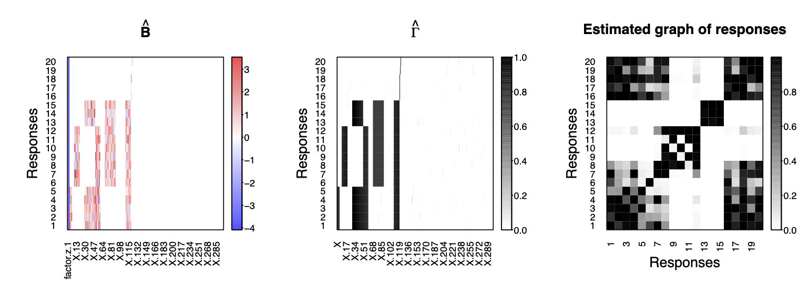

The BayesSUR model has been extended to include mandatory variables by
assigning Gaussian priors as random effects rather than spike-and-slab
priors, named as **SSUR-MRF with random effects** in [Zhao et
al. 2023](https://doi.org/10.1093/jrsssc/qlad102). The R code for the
simulated data and real data analyses in [Zhao et
al. 2023](https://doi.org/10.48550/arXiv.2101.05899) can be found at the
GitHub repository [BayesSUR-RE](https://github.com/zhizuio/BayesSUR-RE).

Here, we show some small examples to run the BayesSUR mdoel with random
effects. To get started, load the package with

    library("BayesSUR")

## Simulate data

We design a network as the following figure (a) to construct a complex
structure between 20 response variables and 300 predictors. It assumes
that the responses are divided into six groups, and the first 120
predictors are divided into nine groups.

<figure>

<figcaption aria-hidden="true"><em>Simulation scenarios:
True relationships between response variables and predictors. (a)
Network structure between <strong>Y</strong> and <strong>X</strong>. (b) Spare latent
indicator variable <em>Γ</em> for the
associations between <strong>Y</strong>
and <strong>X</strong> in the SUR
model. Black blocks indicate nonzero coefficients and white blocks
indicate zero coefficients. (c) Additional structure in the residual
covariance matrix between response variables not explained by <strong>X</strong><strong>B</strong>. Black
blocks indicate correlated residuals of the corresponding response
variables and white blocks indicate uncorrelated residuals of the
corresponding response variables.</em></figcaption>
</figure>

 

Load the simulation function `sim.ssur()` as follows.

    library("gRbase")
    sim.ssur <- function(n, s, p, t0 = 0, seed = 123, mv = TRUE, 
                         t.df = Inf, random.intercept = 0, intercept = TRUE) {
      # set seed to fix coefficients
      set.seed(7193)
      sd_b <- 1
      mu_b <- 1
      b <- matrix(rnorm((p + ifelse(t0 == 0, 1, 0)) * s, mu_b, sd_b), p + ifelse(t0 == 0, 1, 0), s)

      # design groups and pathways of Gamma matrix
      gamma <- matrix(FALSE, p + ifelse(t0 == 0, 1, 0), s)
      if (t0 == 0) gamma[1, ] <- TRUE
      gamma[2:6 - ifelse(t0 == 0, 0, 1), 1:5] <- TRUE
      gamma[11:21 - ifelse(t0 == 0, 0, 1), 6:12] <- TRUE
      gamma[31:51 - ifelse(t0 == 0, 0, 1), 1:5] <- TRUE
      gamma[31:51 - ifelse(t0 == 0, 0, 1), 13:15] <- TRUE
      gamma[52:61 - ifelse(t0 == 0, 0, 1), 1:12] <- TRUE
      gamma[71:91 - ifelse(t0 == 0, 0, 1), 6:15] <- TRUE
      gamma[111:121 - ifelse(t0 == 0, 0, 1), 1:15] <- TRUE
      gamma[122 - ifelse(t0 == 0, 0, 1), 16:18] <- TRUE
      gamma[123 - ifelse(t0 == 0, 0, 1), 19] <- TRUE
      gamma[124 - ifelse(t0 == 0, 0, 1), 20] <- TRUE

      G_kron <- matrix(0, s * p, s * p)
      G_m <- bdiag(matrix(1, ncol = 5, nrow = 5), 
                   matrix(1, ncol = 7, nrow = 7), 
                   matrix(1, ncol = 8, nrow = 8))
      G_p <- bdiag(matrix(1, ncol = 5, nrow = 5), diag(3), 
                   matrix(1, ncol = 11, nrow = 11), diag(9), 
                   matrix(1, ncol = 21, nrow = 21), 
                   matrix(1, ncol = 10, nrow = 10), diag(9), 
                   matrix(1, ncol = 21, nrow = 21), diag(19), 
                   matrix(1, ncol = 11, nrow = 11), diag(181))
      G_kron <- kronecker(G_m, G_p)

      combn11 <- combn(rep((1:5 - 1) * p, each = length(1:5)) + 
                         rep(1:5, times = length(1:5)), 2)
      combn12 <- combn(rep((1:5 - 1) * p, each = length(30:60)) + 
                         rep(30:60, times = length(1:5)), 2)
      combn13 <- combn(rep((1:5 - 1) * p, each = length(110:120)) + 
                         rep(110:120, times = length(1:5)), 2)
      combn21 <- combn(rep((6:12 - 1) * p, each = length(10:20)) + 
                         rep(10:20, times = length(6:12)), 2)
      combn22 <- combn(rep((6:12 - 1) * p, each = length(51:60)) + 
                         rep(51:60, times = length(6:12)), 2)
      combn23 <- combn(rep((6:12 - 1) * p, each = length(70:90)) + 
                         rep(70:90, times = length(6:12)), 2)
      combn24 <- combn(rep((6:12 - 1) * p, each = length(110:120)) + 
                         rep(110:120, times = length(6:12)), 2)
      combn31 <- combn(rep((13:15 - 1) * p, each = length(30:50)) + 
                         rep(30:50, times = length(13:15)), 2)
      combn32 <- combn(rep((13:15 - 1) * p, each = length(70:90)) + 
                         rep(70:90, times = length(13:15)), 2)
      combn33 <- combn(rep((13:15 - 1) * p, each = length(110:120)) + 
                         rep(110:120, times = length(13:15)), 2)
      combn4 <- combn(rep((16:18 - 1) * p, each = length(121)) + 
                        rep(121, times = length(16:18)), 2)
      combn5 <- matrix(rep((19 - 1) * p, each = length(122)) + 
                         rep(122, times = length(19)), nrow = 1, ncol = 2)
      combn6 <- matrix(rep((20 - 1) * p, each = length(123)) + 
                         rep(123, times = length(20)), nrow = 1, ncol = 2)

      combnAll <- rbind(t(combn11), t(combn12), t(combn13), 
                        t(combn21), t(combn22), t(combn23), t(combn24), 
                        t(combn31), t(combn32), t(combn33), 
                        t(combn4), combn5, combn6)

      set.seed(seed + 7284)
      sd_x <- 1
      x <- matrix(rnorm(n * p, 0, sd_x), n, p)

      if (t0 == 0 & intercept) x <- cbind(rep(1, n), x)
      if (!intercept) {
        gamma <- gamma[-1, ]
        b <- b[-1, ]
      }
      xb <- matrix(NA, n, s)
      if (mv) {
        for (i in 1:s) {
          if (sum(gamma[, i]) >= 1) {
            if (sum(gamma[, i]) == 1) {
              xb[, i] <- x[, gamma[, i]] * b[gamma[, i], i]
            } else {
              xb[, i] <- x[, gamma[, i]] %*% b[gamma[, i], i]
            }
          } else {
            xb[, i] <- sapply(1:s, function(i) rep(1, n) * b[1, i])
          }
        }
      } else {
        if (sum(gamma) >= 1) {
          xb <- x[, gamma] %*% b[gamma, ]
        } else {
          xb <- sapply(1:s, function(i) rep(1, n) * b[1, i])
        }
      }

      corr_param <- 0.9
      M <- matrix(corr_param, s, s)
      diag(M) <- rep(1, s)

      ## wanna make it decomposable
      Prime <- list(c(1:(s * .4), (s * .8):s), 
                    c((s * .4):(s * .6)), 
                    c((s * .65):(s * .75)), 
                    c((s * .8):s))
      G <- matrix(0, s, s)
      for (i in 1:length(Prime)) {
        G[Prime[[i]], Prime[[i]]] <- 1
      }

      # check
      dimnames(G) <- list(1:s, 1:s)
      length(gRbase::mcsMAT(G - diag(s))) > 0

      var <- solve(BDgraph::rgwish(n = 1, adj = G, b = 3, D = M))

      # change seeds to add randomness on error
      set.seed(seed + 8493)
      sd_err <- 0.5
      if (is.infinite(t.df)) {
        err <- matrix(rnorm(n * s, 0, sd_err), n, s) %*% chol(as.matrix(var))
      } else {
        err <- matrix(rt(n * s, t.df), n, s) %*% chol(as.matrix(var))
      }

      if (t0 == 0) {
        b.re <- NA
        z <- NA
        y <- xb + err
        if (random.intercept != 0) {
          y <- y + matrix(rnorm(n * s, 0, sqrt(random.intercept)), n, s)
        }

        z <- sample(1:4, n, replace = T, prob = rep(1 / 4, 4))

        return(list(y = y, x = x, b = b, gamma = gamma, z = model.matrix(~ factor(z) + 0)[, ], 
                    b.re = b.re, Gy = G, mrfG = combnAll))
      } else {
        # add random effects
        z <- t(rmultinom(n, size = 1, prob = c(.1, .2, .3, .4)))
        z <- sample(1:t0, n, replace = T, prob = rep(1 / t0, t0))
        set.seed(1683)
        b.re <- rnorm(t0, 0, 2)
        y <- matrix(b.re[z], nrow = n, ncol = s) + xb + err

        return(list(
          y = y, x = x, b = b, gamma = gamma, z = model.matrix(~ factor(z) + 0)[, ],
          b.re = b.re, Gy = G, mrfG = combnAll
        ))
      }
    }

To simulate data with sample size *n* = 250, responsible variables
*s* = 20 and covariates *p* = 300, we can specify the corresponding
parameters in the function `sim.ssur()` as follows.

    library("Matrix")
    n <- 250
    s <- 20
    p <- 300
    sim1 <- sim.ssur(n, s, p, seed = 1)

To simulate data from 4 individual groups with group indicator variables
following the defaul multinomial distribution
*m**u**l**t**i**n**o**m**i**a**l*(0.1,0.2,0.3,0.4), we can simply add
the argument `t0 = 4` in the function `sim.ssur()` as follows.

    t0 <- 4
    sim2 <- sim.ssur(n, s, p, t0, seed = 1) # learning data
    sim2.val <- sim.ssur(n, s, p, t0, seed=101) # validation data

## Run BayesSUR model with random effects

According to the guideline of prior specification in [Zhao et
al. 2023](https://doi.org/10.1093/jrsssc/qlad102), we first set the
following parameters `hyperpar` and then running the BayesSUR model with
random effects via `betaPrior = "reGroup"` (default
`betaPrior = "independent"` with spike-and-slab priors for all
coefficients). **For illustration, we run a short MCMC** with
`nIter = 300` and `burnin = 100`. Note that here the graph used for the
Markov random field prior is the true graph from the returned object of
the simulation `sim2$mrfG`.

    hyperpar <- list(mrf_d = -2, mrf_e = 1.6, a_w0 = 100, b_w0 = 500, a_w = 15, b_w = 60)
    set.seed(1038)
    fit2 <- BayesSUR(
      data = cbind(sim2$y, sim2$z, sim2$x),
      Y = 1:s, 
      X_0 = s + 1:t0, 
      X = s + t0 + 1:p,
      outFilePath = "sim2_mrf_re",
      hyperpar = hyperpar,
      gammaInit = "0",
      betaPrior = "reGroup",
      nIter = 300, burnin = 100,
      covariancePrior = "HIW",
      standardize = F,
      standardize.response = F,
      gammaPrior = "MRF",
      mrfG = sim2$mrfG,
      output_CPO = T
    )

    ## BayesSUR -- Bayesian Seemingly Unrelated Regression Modelling
    ## Reading input files ... ... successfull!
    ## Clearing and initialising output files 
    ## Initialising the (SUR) MCMC Chain ...  ...  DONE!
    ## Drafting the output files with the start of the chain ... DONE! 
    ## 
    ## Starting 2 (parallel) chain(s) for 300 iterations:
    ## Temperature ladder updated, new temperature ratio : 1.1
    ##  MCMC ends.   --- Saving results and exiting
    ## Saved to :   sim2_mrf_re/data_SSUR_****_out.txt
    ## Final w0  : 4.9971
    ## Final w   : 2.29497
    ## Final tau : 0.293487    w/ proposal variance: 1.2229
    ## Final eta : 0.0471505
    ##   -- Average Omega : 0
    ## Final temperature ratio : 1.1
    ## 
    ## DONE, exiting!

Check some summarized information of the results:

    summary(fit2)

    ## Call:
    ##   BayesSUR(data = cbind(sim2$y, sim2$z, sim2$x), ...)
    ## 
    ## CPOs:
    ##         Min.      1st Qu.       Median      3rd Qu.         Max. 
    ## 0.0001896996 0.0242732651 0.0348570615 0.0465600279 0.1312571329 
    ## 
    ## Number of selected predictors (mPIP > 0.5): 19 of 20x300
    ## 
    ## Top 10 predictors on average mPIP across all responses:
    ##     X.74     X.69     X.77     X.82    X.114    X.116    X.122    X.157    X.265 
    ## 0.081840 0.049500 0.049500 0.049500 0.049500 0.049500 0.049500 0.049500 0.049500 
    ##     X.16 
    ## 0.047015 

    ## Top 10 responses on average mPIP across all predictors:
    ##         X.8        X.10         X.5        X.19        X.11         X.9         X.6 
    ## 0.012703000 0.010049000 0.007943333 0.006600000 0.005522333 0.004029667 0.003001667 
    ##        X.12         X.2         X.4 
    ## 0.002852333 0.002769667 0.002404667 
    ## 
    ## Expected log pointwise predictive density (elpd) estimates:
    ##   elpd.LOO = -16803.49,  elpd.WAIC = -16799.94
    ## 
    ## MCMC specification:
    ##   iterations = 300,  burn-in = 100,  chains = 2
    ##   gamma local move sampler: bandit
    ##   gamma initialisation: 0
    ## 
    ## Model specification:
    ##   covariance prior: HIW
    ##   gamma prior: MRF
    ## 
    ## Hyper-parameters:
    ##   a_w   b_w    nu a_tau b_tau a_eta b_eta mrf_d mrf_e  a_w0  b_w0 
    ##  15.0  60.0  22.0   0.1  10.0   0.1   1.0  -2.0   1.6 100.0 500.0

Show the estimates of regression coefficients, variable selection
indicators and residual graph

    # show estimates
    plot(fit2, estimator=c("beta","gamma","Gy"), type="heatmap", name.predictors = "auto")

<figure>

<figcaption aria-hidden="true"><em>Simulation result:
Estimates of regression coefficients, variable selection indicators and
residual graph.</em></figcaption>
</figure>

Compute the model performance with respect to **variable selection**

    # compute accuracy, sensitivity, specificity of variable selection
    gamma <- getEstimator(fit2)
    (accuracy <- sum(data.matrix(gamma > 0.5) == sim2$gamma) / prod(dim(gamma)))

    ## [1] 0.8725

    (sensitivity <- sum((data.matrix(gamma > 0.5) == 1) & (sim2$gamma == 1)) / sum(sim2$gamma == 1))

    ## [1] 0.01558442

    (specificity <- sum((data.matrix(gamma > 0.5) == 0) & (sim2$gamma == 0)) / sum(sim2$gamma == 0))

    ## [1] 0.9986616

Compute the model performance with respect to **response prediction**

    # compute RMSE and RMSPE for prediction performance
    beta <- getEstimator(fit2, estimator = "beta", Pmax = .5, beta.type = "conditional")
    (RMSE <- sqrt(sum((sim2$y - cbind(sim2$z, sim2$x) %*% beta)^2) / prod(dim(sim2$y))))

    ## [1] 8.723454

    (RMSPE <- sqrt(sum((sim2.val$y - cbind(sim2.val$z, sim2.val$x) %*% beta)^2) / prod(dim(sim2.val$y))))

    ## [1] 8.859939

Compute the model performance with respect to **coefficient bias**

    # compute bias of beta estimates
    b <- sim2$b
    b[sim2$gamma == 0] <- 0
    (beta.l2 <- sqrt(sum((beta[-c(1:4), ] - b)^2) / prod(dim(b))))

    ## [1] 0.5039502

Compute the model performance with respect to **covariance selection**

    g.re <- getEstimator(fit2, estimator = "Gy")
    (g.accuracy <- sum((g.re > 0.5) == sim2$Gy) / prod(dim(g.re)))

    ## [1] 0.585

    (g.sensitivity <- sum(((g.re > 0.5) == sim2$Gy)[sim2$Gy == 1]) / sum(sim2$Gy == 1))

    ## [1] 0.2475248

    (g.specificity <- sum(((g.re > 0.5) == sim2$Gy)[sim2$Gy == 0]) / sum(sim2$Gy == 0))

    ## [1] 0.9292929

## Referrence

> Zhi Zhao, Marco Banterle, Alex Lewin, Manuela Zucknick (2023).
> Multivariate Bayesian structured variable selection for
> pharmacogenomic studies. *Journal of the Royal Statistical Society:
> Series C (Applied Statistics)*, qlad102. DOI:
> [10.1093/jrsssc/qlad102](https://doi.org/10.1093/jrsssc/qlad102).
